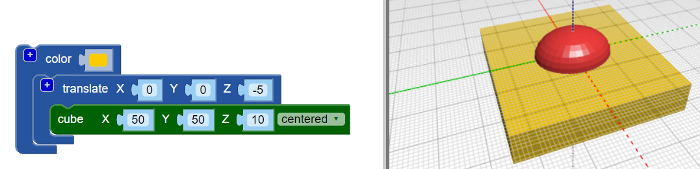

## Achatar a base do corpo

Agora alise a base do corpo para tornar seu bug mais realista. Um modelo com base plana também é mais fácil para imprimir em 3D!

Para fazer isso, você pode simplesmente remover um cuboide do seu modelo usando o bloco `diferença`{: class = "blockscadsetops"}.

--- task ---

Para começar, crie um cubóide para cobrir a metade inferior do bug (a parte que fica abaixo de 0 no eixo Z).

O cubóide deve ter `centrado de` e 10 mm de altura (ao longo do eixo Z).

Adicionar um `traduzir` bloco para mover o -5mm cubóide ao longo do eixo Z (para baixo).

Para facilitar a separação do cubóide e do corpo do inseto, adicione um bloco de `cor` para tornar o cubóide de uma cor diferente.

O cubóide é maior que o corpo do inseto. Isso significa que você pode adicionar ao bug sem precisar aumentar o cubóide posteriormente.

--- /task ---

--- task ---

Use um bloco `{`: class = "blockscadsetops"} de diferença  para remover o cubóide do corpo. 

Agora o corpo do seu inseto tem uma base plana!

Arraste seu modelo no visualizador para vê-lo de diferentes ângulos. 

--- /task ---

  
