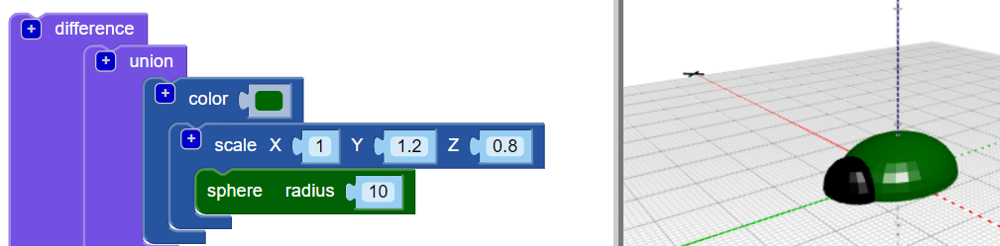

## Adicione uma cabeça ao seu inseto

Agora crie uma cabeça para o inseto.

--- task ---

Adicione uma esfera menor com o bloco `sphere` como a cabeça do inseto. No momento, você não consegue ver esta nova esfera, porque está escondida dentro do corpo.

Além disso, adicione um bloco `scale` ao bloco `sphere` para moldar a cabeça.

Em seguida, adicione um bloco `union`{:class="blockscadsetops"} para juntar a cabeça ao corpo.

--- /task --- --- task ---

Se você quiser ver a sua nova `esfera` desative temporariamente o corpo clicando com o botão direito no bloco `scale`{:class="blockscadtransforms"} e selecione **Disable Block**. Em seguida, esse bloco e os que estão dentro dele ficam acinzentados e o corpo não irá aparecer quando você clicar em **Render**.

Clique com o botão direito do mouse no bloco novamente e escolha **Ativar bloco** para ativar o corpo.

--- /task --- --- task ---

`Traduza` a cabeça ao longo do eixo Y, para que fique fora do corpo.

  

--- /task --- --- task ---

Se você quiser ver claramente as diferentes formas, altere a cor da cabeça.

Você também pode experimentar diferentes combinações de cores para decorar seu bug impresso com marcadores permanentes.

--- /task --- --- task ---

Você pode mudar a cor do corpo do seu modelo de bug? Você pode alterá-lo para a cor do filamento com o qual deseja imprimir ou para a cor do marcador permanente com o qual deseja colorir.

--- hints --- --- hint ---

Este é o bloco que você precisa.

--- /hint ---

--- hint ---

Aqui está um exemplo com um corpo verde:

--- /hint --- --- /hints --- --- /task ---

  
