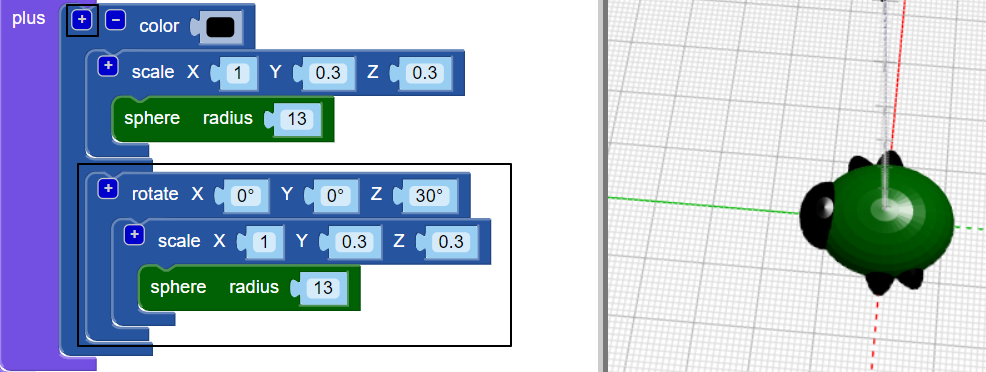

## Criar patas

Agora o inseto precisa de seis patas!

--- task ---

Primeiro, coloque um par de patas no meio do corpo do inseto.

Clique no `+` na parte superior do bloco `union` para adicionar outra seção. Adicione uma `esfera (sphere)` esticada para criar um par de patas.

--- /task ---

--- task ---

Se quiser, você pode desativar o corpo do inseto para ver como as patas são feitas.

Em seguida, habilite o corpo novamente para continuar trabalhando no seu inseto.

--- /task ---

--- task ---

Agora adicione outro par de patas.

Adicione outro conjunto de blocos `scale` e `sphere` com as mesmas configurações. Em seguida, adicione o bloco `rotate` com `30º` no eixo Z, para que as patas fiquem inclinadas.

Agora, o seu inseto tem o par de patas intermediárias uma pata dianteira de um lado e uma pata traseira do outro lado!

--- /task ---

--- task ---

Você pode adicionar um terceiro par de patas para que o inseto tenha três patas de cada lado?

Seu inseto precisa ter a seguinte aparência:

--- hints ---
 --- hint ---

Você precisa adicionar um terceiro conjunto de blocos `scale` e `sphere`.

Use o bloco `rotate`{:class="blockscadtransforms"} na direção oposta à segunda `esfera (sphere)`. Existem 360 graus em um círculo.

Aqui estão os blocos que você precisa:

--- /hint ---

--- hint ---

Aqui está o código que você precisa:

--- /hint ---

--- /hints --- --- /task ---