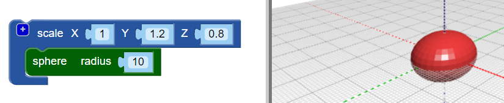

## Dá um corpo ao teu inseto

--- task ---

Abre o editor BlocksCAD num navegador de internet [blockscad3d.com/editor/](https://www.blockscad3d.com/editor/){: target = "_ blank"}

--- /task ---

Agora cria o corpo do teu inseto.

--- task ---

Começa com uma `esfera` com um raio de `10` (a unidade aqui é milímetros):

Clica no botão **Render** para ver o resultado.

Dica: Podes alterar a cor do modelo renderizado clicando no quadrado colorido.

--- /task --- --- task ---

Agora estica a esfera ao longo do seu eixo Y para dar ao inseto um corpo alongado.

O bloco `escala`{: class = "blockscadtransforms"} permite esticar ou esmagar objetos ao longo dos eixos X, Y e Z. Define o valor Y como `1.2` para esticar a esfera ao longo do eixo Y.

Clica em **Render** novamente e verifique se a esfera foi esticada a até se tornar num elipsóide. Olhe para o teu modelo a partir de diferentes ângulos para veres o que mudou.

--- /task ---

Dica: sempre que fizeres uma alteração no código, clica em **Render** para ver os resultados.

--- task ---

Agora esmaga o elipsóide um pouco ao longo do eixo z para criar um inseto mais plano.

Definir um valor de eixo abaixo de `1` diminui o objeto ao longo desse eixo. Portanto, altera o valor Z no bloco `escala`{: class = "blockscadtransforms"} para `0.8`.

--- /task ---

