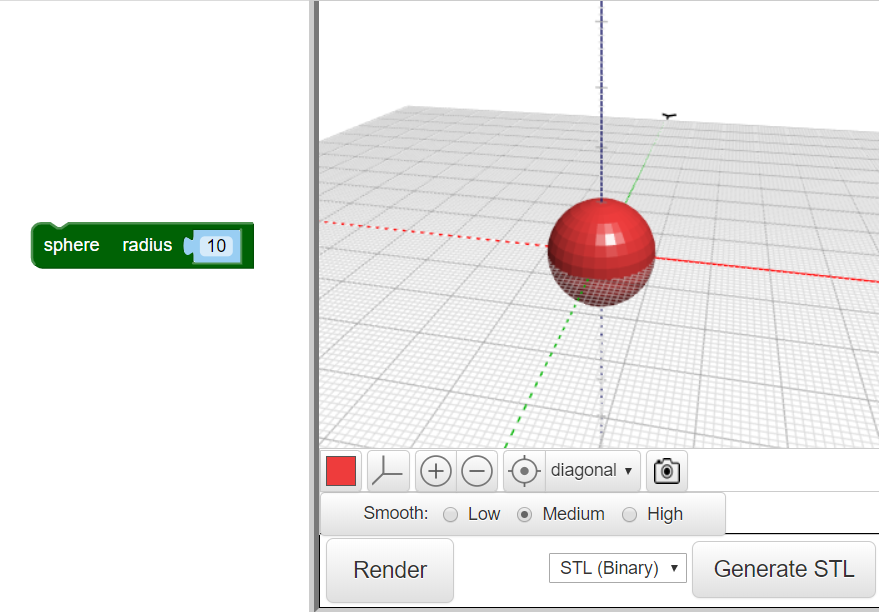

## Dă-i insectei un corp

--- task ---

Deschide editorul BlocksCAD într-un browser web [blockscad3d.com/editor/](https://www.blockscad3d.com/editor/){:target="_blank"}

--- /task ---

Acum creează corpul insectei tale.

--- task ---

Începe cu o `sferă` cu o rază de `10` (unitatea de aici are milimetri):

Fă click pe butonul **Render** pentru a vedea rezultatul.

Sfat: poți schimba culoarea modelului randat dând click pe pătratul colorat.

--- /task --- --- task ---

Acum întinde sfera de-a lungul axei sale Y pentru a crea un corp alungit pentru insectă.

Blocul `scale`{:class="blockscadtransforms"} îți permite să întinzi sau să spargi obiecte de-a lungul axelor X, Y și Z. Setează valoarea Y la `1.2` pentru a extinde sfera de-a lungul axei Y.

Dă click din nou pe **Render** și verifică dacă sfera a fost întinsă într-un elipsoid. Privește-ți modelul din unghiuri diferite pentru a vedea cum s-a schimbat.

--- /task ---

Sfat: de fiecare dată când faci o modificare a codului, trebuie să dai click pe **Render** pentru a vedea rezultatele.

--- task ---

Acum, strivește elipsoidul un pic de-a lungul axei Z pentru a face insecta plată.

Setarea unei valori a axei sub `1` face ca obiectul să fie mai mic de-a lungul acelei axe. Așa că, schimbă valoarea Z din blocul `scale`{:class="blockscadtransforms"} la `0.8`.

--- /task ---

