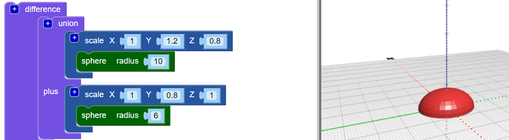

## Adăugați un cap la eroare

Acum creați un cap pentru eroare.

--- task ---

Adăugați o mai mică `sferă` ca cap al erorii. Momentan nu puteți vedea această sferă nouă, deoarece este ascunsă în interiorul corpului.

Adăugați, de asemenea, un bloc de `scară` la noua `sferă` pentru a modela capul.

Apoi adăugați un bloc `union`{: class = "blockcadsetops"} pentru a combina capul și corpul.

--- /task --- --- task ---

Dacă doriți să vedeți noua `sferă`, atunci dezactivați temporar corpul făcând clic dreapta pe blocul său `scara`{: class = "blockcadtransforms"} și alegând **Dezactivați blocul**. Apoi, acest bloc și cele din interior sunt lăsate la culoare și corpul nu apare atunci când faceți clic pe **Render**.

Faceți clic dreapta pe bloc din nou și alegeți **Activați blocul** pentru a activa corpul.

--- /task --- --- task ---

`Traduceți` capul de-a lungul axei Y, astfel încât să rămână afară din corp.

  

--- /task --- --- task ---

Dacă doriți să vedeți clar diferitele forme, schimbați culoarea capului.

Puteți experimenta, de asemenea, diferite combinații de culori pentru decorarea erorii tipărite cu markere permanente.

--- /task --- --- task ---

Puteți schimba culoarea corpului modelului dvs. de erori? Puteți schimba culoarea filamentului cu care doriți să imprimați sau culoarea markerului permanent cu care doriți să o colorați.

--- hints --- --- hint ---

Acesta este blocul de care aveți nevoie.

--- /hint ---

--- hint ---

Iată un exemplu cu un corp verde:

--- /hint --- --- /hints --- --- /task ---

  
