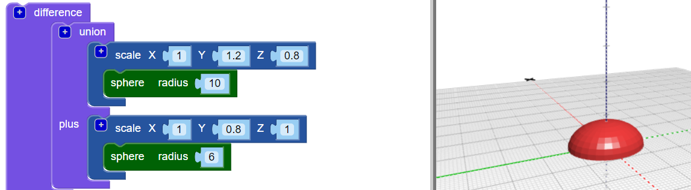

## Pridajte hlavu k svojej chybe

Teraz vytvorte hlavu pre chybu.

--- task ---

Pridajte menšiu `guľu` ako hlavu chyby. Momentálne nemôžete vidieť túto novú guľu, pretože je skrytá vo vnútri tela.

Taktiež pridajte blok `stupnice` do novej `gule` aby ste tvarovali hlavu.

Potom pridajte `únie`{: class = "blockscadsetops"} blok na kombináciu hlavy a tela.

--- /task --- --- task ---

Ak chcete vidieť novú `guľu`, potom dočasne vypnite telo kliknutím pravým tlačidlom myši na jeho blok `stupnice`{: class = "blockscadtransforms"} a výberom **Zakázať blok**. Potom tento blok a tie, ktoré sú v ňom, sú sivé a telo sa po kliknutí na **Vykreslenie**nezobrazí.

Opäť kliknite pravým tlačidlom myši na blok a vyberte **Povoliť blok** čím telo aktivujete.

--- /task --- --- task ---

`Preložte` hlavu pozdĺž osi Y tak, aby vyčnievala z tela.

  

--- /task --- --- task ---

Ak chcete zreteľne vidieť rôzne tvary, zmeňte farbu hlavy.

Môžete tiež experimentovať s rôznymi farebnými kombináciami na ozdobenie vytlačenej chyby trvalými značkami.

--- /task --- --- task ---

Môžete zmeniť farbu tela modelu chyby? Dalo by sa zmeniť na farbu vlákna, s ktorým chcete tlačiť, alebo na farbu permanentnej značky, s ktorou chcete farbu zafarbiť.

--- hints --- --- hint ---

Toto je blok, ktorý potrebujete.

--- /hint ---

--- hint ---

Tu je príklad so zeleným telom:

--- /hint --- --- /hints --- --- /task ---

  
