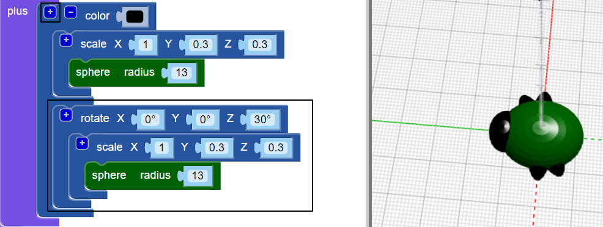
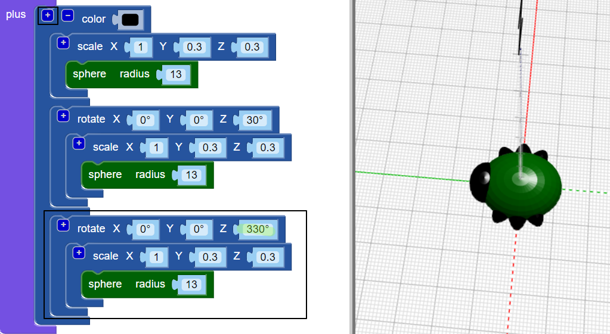

## Vytvorte nohy

Teraz chyba potrebuje šesť nôh!

--- task ---

Najprv do stredu tela bugu vložte pár nôh.

Kliknutím na `+` v hornej časti bloku `únie` pridáte ďalšiu sekciu. Pridanie napnutú `guľu` vytvoriť dvojicu ramien.

--- /task ---

--- task ---

Ak chcete, môžete zakázať telo chyby a zistiť, ako sa vytvárajú nohy.

Potom umožnite telu pokračovať v práci na chybe.

--- /task ---

--- task ---

Teraz pridajte ďalšiu nohu.

Pridať ďalšie `zmenšený` `guľa` s rovnakým nastavením. Potom `otočte` o `30` smerom dolu pozdĺž osi Z, aby nohy stúpali pod uhlom.

Teraz má vaša chyba dve stredné nohy a každú prednú a zadnú nohu.

--- /task ---

--- task ---

Môžete pridať tretí pár nôh, aby chyba mala tri kompletné sady párov nôh?

Vaša chyba musí vyzerať takto:

--- hints --- --- hint ---

Musíte pridať tretiu `mierku` `gule`.

`Otočte`{: class = "blockscadtransforms"} v opačnom smere ako druhá `guľa`. V kruhu je 360 stupňov.

Tu sú bloky, ktoré potrebujete:

--- /hint ---

--- hint ---

Tu je kód, ktorý potrebujete:

--- /hint ---

--- /hints --- --- /task ---