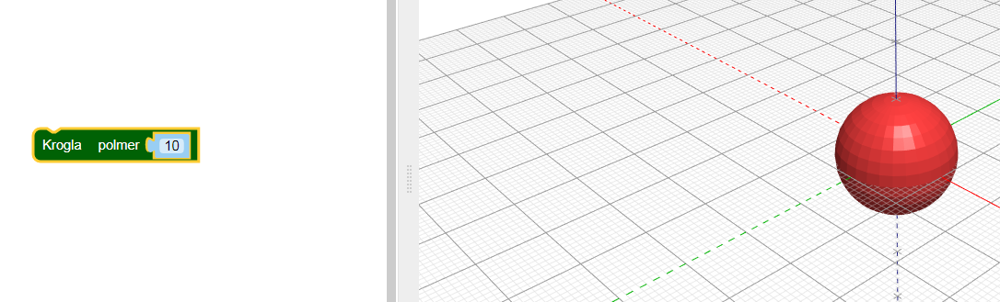
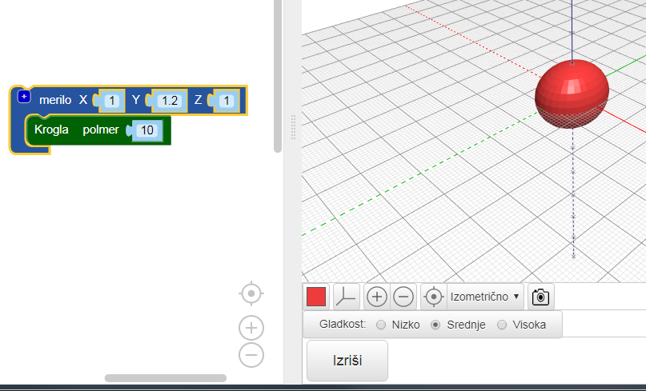
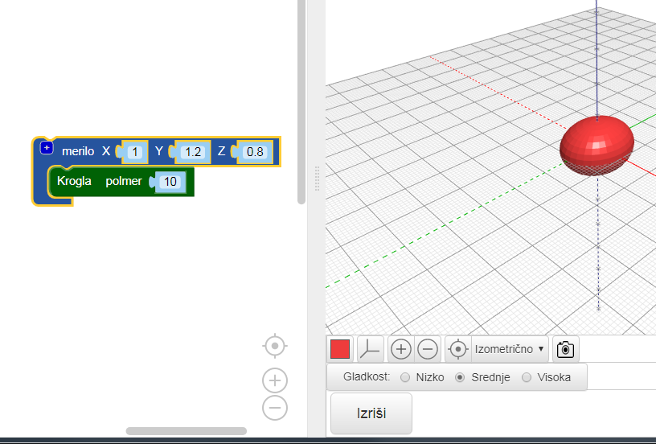

## Hrošču daj telo

--- task ---

Odpri urejevalnik BlocksCAD v spletnem brskalniku [blockcad3d.com/editor/](https://www.blockscad3d.com/editor/){:target="_blank"}

--- /task ---

Zdaj pa ustvari telo hrošča.

--- task ---

Začni s `kroglo`, ki ima polmer `10` (enota je v milimetrih):

Za prikaz rezultata klikni gumb **Izriši**.

Nasvet: barvo izrisanega modela lahko spremeniš s klikom na barvni kvadrat.

--- /task --- --- task ---

Zdaj raztegni kroglo vzdolž osi Y, da ustvariš podolgovato telo hrošča.

Blok `merilo`{: class = "blockcadtransforms"} ti omogoča, da raztegneš ali stisneš predmet vzdolž osi X, Y ali Z. Nastavi vrednost Y na `1.2`, da raztegneš kroglo vzdolž osi Y.

Znova klikni **Izriši** in poglej, ali je krogla raztegnjena v elipsoid. Oglej si svoj model z različnih zornih kotov, da bosš videl, kako se je spremenil.

--- /task ---

Nasvet: vsakič, ko spremeniš kodo, moraš klikniti **Izriši**, da vidiš rezultat.

--- task ---

Zdaj elipsoid nekoliko stisni vzdolž osi z, da postane hrošč bolj sploščen.

Če nastaviš vrednost osi pod `1` se objekt zmanjša po tej osi. Spremeni torej vrednost Z v bloku `merilo`{:class="blockscadtransforms"} na `0.8`.

--- /task ---

