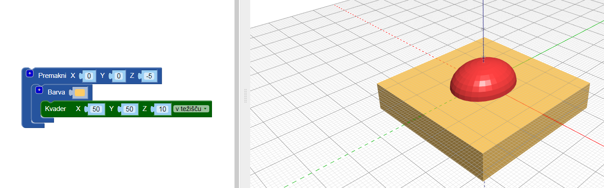

## Splošči dno telesa

Zdaj pa splošči še spodnji del telesa, da bo hrošč videti bolj resnično. 3D tisk je lažji tudi model z ravno podlago! Prav tako je lažje 3D natisniti model z ravnim dnom!

Za dosego tega, lahko preprosto svojemu modelu odzameš kvader z uporabo bloka `razlika`{:class="blockscadsetops"}.

--- task ---

Najprej ustvari kvader, ki pokrije spodnjo polovico hrošča (del, ki se nahaja pod 0 na osi Z).

Kvader mora biti poravnan v `težišču` in 10 mm visok (po Z osi).

Dodaj blok `premakni`, da premakneš kvader za -5mm po Z osi.

Za lažje razlikovanje med kvadrom in telesom hrošča, mu dodaj blok `barva` in mu določi drugo barvo.

Kvader je večji od telesa hrošča. To pomeni, da lahko hrošču dodajaš, ne da bi kasneje moral povečati kvader.

--- /task ---

--- task ---

Uporabi blok `razlika`{:class="blockcadsetops"}, da odstraniš kvader iz telesa.

Zdaj ima telo tvojega hrošča ravno podlago!

V pregledovalniku si s pomočjo vlecenja miške oglej svoj model z različnih zornih kotov.

--- /task ---

  
