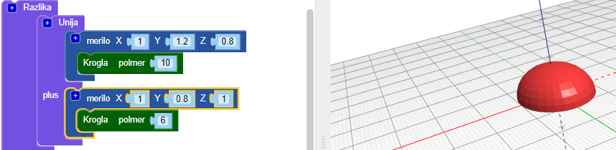
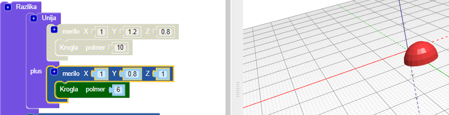
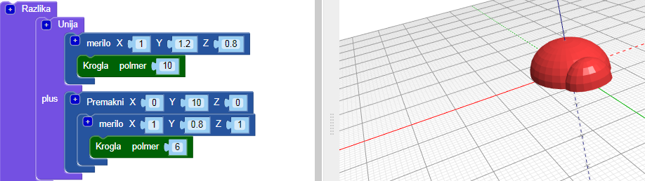
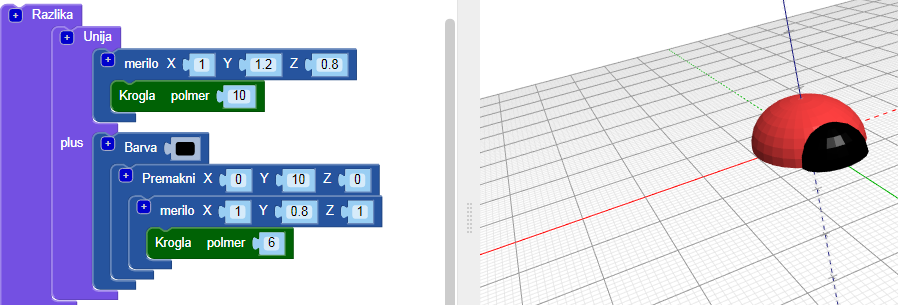
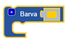

## Hrošču dodaj glavo

Sedaj hrošču ustvari glavo.

--- task ---

Za glavo hrošča dodaj manjšo `kroglo`. Te nove krogle trenutno še ne vidiš, ker je skrita v telesu.

Tudi tej `krogli` dodaj blok `merilo`, da jo oblikuješ.

Nato doda blok `združi`{:class="blockcadsetops"}, da združiš glavo in telo.

--- /task --- --- task ---

Če si želiš ogledati novo `kroglo`, začasno onemogoči telo z desnim klikom na `merilo`{: class = "blockscadtransforms"} blok in izbiro **Onemogoči kocko**. Ta blok in tisti v njemu so sedaj osiveli, telo pa se več ne pojavi, ko pritisneš **Izriši**.

Znova z desno tipko miške klikni na ta blok in izberi **Omogoči blok** da vklopiš prikaz bloka.

--- /task --- --- task ---

`Premakni` glavo vzdolž osi Y, da bo štrlela iz telesa.

  

--- /task --- --- task ---

Če želiš različne like videti bolj jasno, spremeni barvo glave.

Prav tako lahko eksperimentiraš z različnimi barvnimi kombinacijami za okrasitev tiskanega hrošča s permanentnimi pisali.

--- /task --- --- task ---

Ali lahko modelu hrošča spremeniš barvo telesa? Lahko ga spremeniš v barvo nitke, s katero ga želiš natisniti, ali v barvo permanentnega pisala, s katerim ga boš barval.

--- hints --- --- hint ---

To je blok, ki ga potrebuješ.

--- /hint ---

--- hint ---

Tu je primer z zelenim telesom:

--- /hint --- --- /hints --- --- /task ---

  
