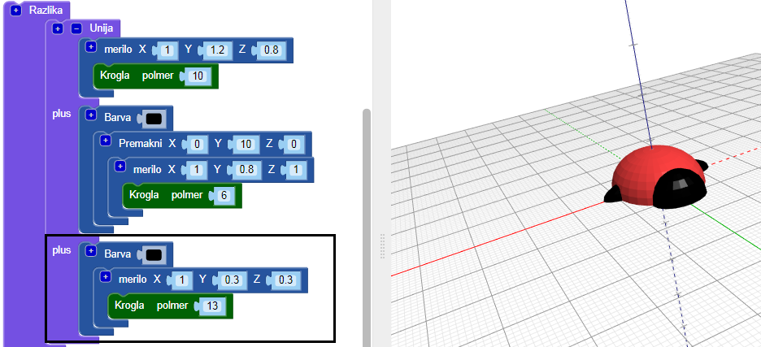
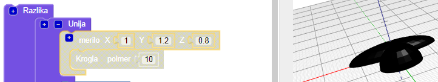
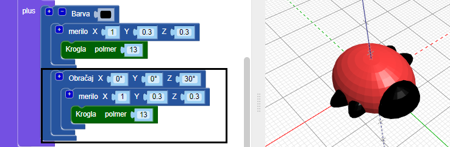
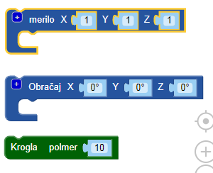
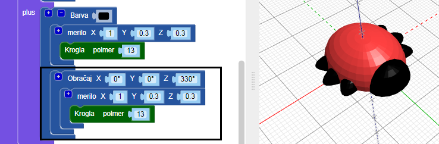

## Ustvari noge

Zdaj hrošč potrebuje šest nog!

--- task ---

Najprej postavi par nog na sredino hroščevega telesa.

Klikni `+` na vrhu bloka `unija`, da dodaš še en razdelek. Dodaj raztegnjeno `kroglo`, da ustvariš par nog.

--- /task ---

--- task ---

Če želiš, lahko skriješ telo hrošča in si ogledaš, kako so narejene noge.

Nato spet omogočiš prikaz telesu, da lahko nadaljuš pri oblikovanju svojega hrošča.

--- /task ---

--- task ---

Dodaj še en par nog.

Dodajte še eno `raztegnjeno` `kroglo` z enakimi nastavitvami. Nato jih `obrni` za `30` navzdol osi Z, tako da se noge držijo pod kotom.

Zdaj ima vaš hrošč dve srednji nogi in po eno sprednjo ter zadnjo nogo!

--- /task ---

--- task ---

Ali lahko dodaš tretji par nog, tako da ima hrošč tri popolne sklope parov nog?

Vaš hrošč mora izgledati tako:

--- hints --- --- hint ---

Dodati moraš še tretjo `pomanjšano` `kroglo`.

`Obrni`{: class = "blockcadtransforms"} jo v nasprotni smeri od druge `krogle`. Krog ima 360 stopinj.

To so potrebni bloki:

--- /hint ---

--- hint ---

Tukaj je koda, ki jo potrebuješ:

--- /hint ---

--- /hints --- --- /task ---