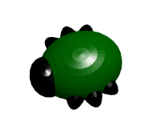

## Увод

У овом пројекту, БлоцксЦАД ћете користити за дизајнирање 3Д бубе или инсекта користећи геометријске облике.

Ако имате приступ 3Д штампачу, можете да штампате грешку коју дизајнирате. Једном када вам се грешка одштампа, можете додати детаље помоћу трака за трајно означавање.

Такође ћете моћи да користите вештине које сте научили да дизајнирате сопствену грешку или друго биће користећи геометријске облике.

Грешке доносе велике награде за уклањање погрешака!

### Шта ћеш направити

Готов буг изгледа овако:

Ако имате приступ 3Д штампачу, можете да штампате своју грешку и затим је украсите.

Већина 3Д штампача може да штампа само у једној боји, тако да можете додати детаље помоћу трајних маркера како би ваш буг изгледао још боље.

--- collapse ---
---
title: Шта ће ти бити потребно
---

### Хардвер

+ 3Д штампач и нит у боји по вашем избору
+ Оловке за трајно обележавање у боји у разним бојама - металне боје делују добро

### Софтвер

+ Овај пројекат се може завршити у веб претраживачу помоћу БлоцксЦАД [блоцксцад3д.цом/едитор/](https://www.blockscad3d.com/editor){: таргет = "_ бланк"}

--- /collapse ---

--- collapse ---
---
title: Шта ћеш научити
---

+ 3Д моделирање са геометријским облицима (сфере)
+ Користећи `скале` протегнути геометиц облике

--- /collapse ---

--- collapse ---
---
title: Додатне информације за наставнике
---

Уколико желите да одштампате овај пројекат, молимо Вас користите [верзију за штампање](https://projects.raspberrypi.org/en/projects/blockscad-bug/print){:target="_blank"}.

Преузмите готов пројектни код на [рпф.ио/п/ен/блоцксцад-буг-гет](http://rpf.io/p/en/blockscad-bug-get).

--- /collapse ---
