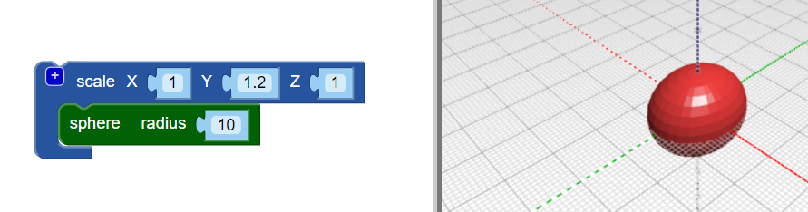

## Böceğinize bir beden verin

--- task ---

BlocksCAD düzenleyicisini bir web tarayıcısında açın [blockscad3d.com/editor/](https://www.blockscad3d.com/editor/){: target = "_ blank"}

--- /task ---

Şimdi hatanızın gövdesini oluşturun.

--- task ---

Yarıçapı `10` olan `küre` ile başlayın (buradaki birim milimetredir):

Sonucu görmek için **Oluştur** düğmesine tıklayın.

İpucu: renkli kareye tıklayarak oluşturulan modelin rengini değiştirebilirsiniz.

--- /task --- --- task ---

Böcek için uzun bir gövde oluşturmak için küreyi Y ekseni boyunca uzatın.

`ölçek`{: class = "blockscadtransforms"} bloğu, nesneleri X, Y ve Z eksenleri boyunca uzatmanıza veya ezmenize olanak tanır. Küreyi Y ekseni boyunca uzatmak için Y değerini `1.2` olarak ayarlayın.

Tekrar **Render** tıklayın ve kürenin bir elipsoide gerildiğini kontrol edin. Modelinize farklı açılardan bakın, böylece nasıl değiştiğini görebilirsiniz.

--- /task ---

İpucu: kodda her değişiklik yaptığınızda, sonuçları görmek için **Render** tıklamanız gerekir.

--- task ---

Şimdi daha düz bir hata yapmak için elipsoidi z ekseni boyunca biraz ezin.

Bir eksen değerinin `1` altına ayarlanması, nesneyi bu eksen boyunca küçültür. Bu yüzden `ölçeği`{: class = "blockscadtransforms"} bloğundaki Z değerini `0.8`.

--- /task ---

