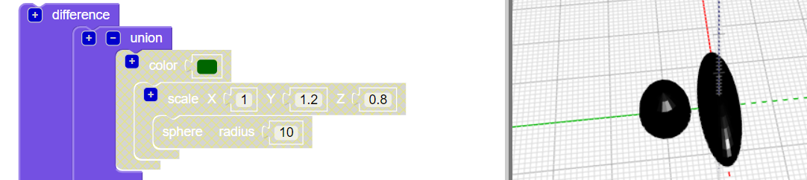

## Bacak oluştur

Şimdi böceğe altı bacak gerekiyor!

--- task ---

Önce böceğin vücudunun ortasına bir çift bacak koyun.

Başka bir bölüm eklemek için `union` bloğunun üstündeki `+` tıklayın. Bir çift bacak oluşturmak için gerilmiş `sphere` ekleyin.

--- /task ---

--- task ---

İsterseniz, bacakların nasıl yapıldığını görmek için böceğin gövdesini devre dışı bırakabilirsiniz.

Ardından böceğin üzerinde çalışmaya devam etmek için vücudu tekrar etkinleştirin.

--- /task ---

--- task ---

Şimdi başka bir çift bacak ekleyin.

Aynı ayarlarla `scaled` `sphere` ekleyin. Daha sonra `rotate` kullanarak Z ekseni boyunca `30` derece döndürün, böylece bacaklar bir açıyla dışarı çıkmış olur.

Şimdi böceğinizin iki orta bacağı ve bir ön bacağı ve de arka bacağı var!

--- /task ---

--- task ---

Böceğin üç komple bacak çifti seti olması için üçüncü bir çift bacak ekleyebilir misiniz?

Böceğinizin şöyle görünmesi gerekir:

--- hints --- --- hint ---

Üçüncü bir `scaled` `sphere` eklemeniz gerekir.

`Rotate`{: class = "blockscadtransforms"} kullanarak ikinci `sphere`'in tersi yönde döndürün. Bir daire içinde 360 derece vardır.

İşte ihtiyacınız olan bloklar:

--- /hint ---

--- hint ---

İşte ihtiyacınız olan kod:

--- /hint ---

--- /hints --- --- /task ---