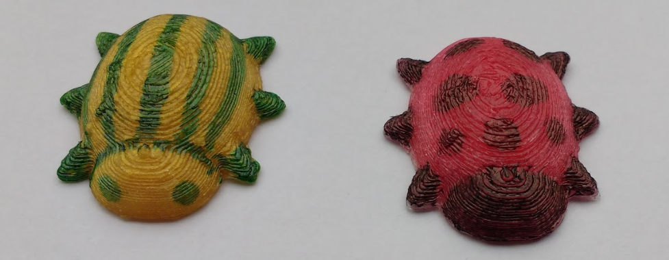

## 3D baskı ve tasarımınızı süsleyin

Bir 3D yazıcıya erişiminiz varsa, şimdi hatanızı yazdırabilir ve daha sonra dekore edebilirsiniz.

--- task ---

Modelinizi oluşturun ve ardından **STL**Oluştur'u tıklayın. STL dosyasını nereye kaydettiğinizi unutmayın.

--- /task --- --- task ---

3D hata yazdırın.

Böceğinizin ana rengini kullanarak yazdırabilirsiniz veya açık veya beyaz filament kullanabilirsiniz.

--- /task ---

--- task ---

Kalıcı marker kalemleri kullanarak hatanızı bitirin!

Baş ve bacakları siyah renklendirebilir veya başka bir renkte lekeler veya şeritler ekleyebilirsiniz.

İşte bazı örnekler:

--- /task ---

 

  
