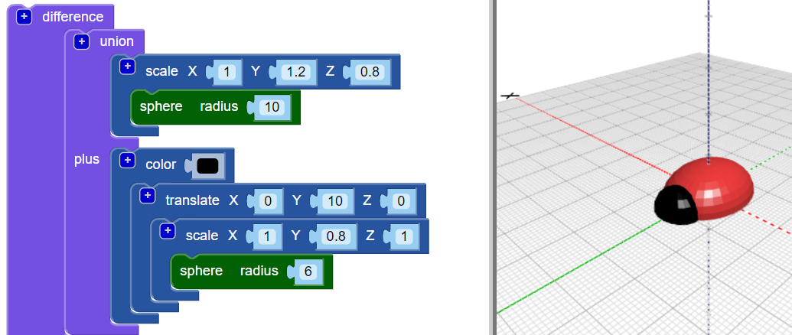

## Додай голову до свого жука

Тепер створи голову для жука.

--- task ---

Додай меншу сферу (`sphere`) як голову жука. Зараз ти не можеш побачити цю нову сферу, оскільки вона захована всередині тіла.

Також додай блок `scale` до нової `sphere`, щоб надати голові форму.

Потім додай блок `union`{:class="blockscadsetops"}, щоб поєднати голову та тіло.

--- /task --- --- task ---

Якщо ти хочеш побачити нову сферу (`sphere`), тоді тимчасово сховай тіло, клацнувши правою кнопкою миші на його блок `scale`{:class="blockscadtransforms"} і вибравши **Disable block**. Після цього цей блок разом із тими, які знаходяться всередині, затіняютья, і тіло не з’являється, коли ти натискаєш **Render**.

Клацни на блоці ще раз правою кнопкою миші та вибери **Enable block**, щоб показати тіло.

--- /task --- --- task ---

Перенеси (`translate`) голову вздовж осі Y, щоб вона виглядала з тіла.

  

--- /task --- --- task ---

Якщо ти хочеш чітко розрізняти різні частини, зміни колір голови.

Також ти можеш експериментувати з різними поєднаннями кольорів під час прикрашання надрукованого жука перманентними маркерами.

--- /task --- --- task ---

Чи можеш ти змінити колір тіла моделі свого жука? Ти можеш змінити його на колір матеріалу, з якого ти хочеш його надрукувати, або на колір перманентного маркера, яким ти хочеш його розмалювати.

--- hints --- --- hint ---

Ось блок, який тобі потрібен.

--- /hint ---

--- hint ---

Ось приклад із зеленим тілом:

--- /hint --- --- /hints --- --- /task ---

  
