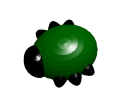

## 简介

在此项目中，您将使用BlocksCAD通过使用几何形状来设计一个3D昆虫。

如果您有条件使用3D打印机，则可以3D打印你设计的昆虫。 在昆虫打印完成后，您可以使用记号笔添加细节。

您还可以使用所学的技能，使用几何形状设计自己的错误或其他生物。

这些错误为调试带来了巨大的回报！

### 你将制作：

完成的错误如下所示：

如果您有权使用3D打印机，则可以打印错误，然后对其进行装饰。

大多数3D打印机只能打印一种颜色，因此您可以使用永久性标记添加详细信息，以使错误看起来更好。

--- collapse ---
---
title: 你需要准备什么
---

### 硬件部分

+ 3D打印机和您选择的颜色的灯丝
+ 多种颜色的彩色永久性记号笔-金属色效果很好

### 软件

+ 该项目可以使用BlocksCAD Web浏览器中完成 [blockscad3d.com/editor/](https://www.blockscad3d.com/editor){：目标=“_空白”}

--- /collapse ---

--- collapse ---
---
标题: 你将学会什么
---

+ 具有几何形状（球体）的3D建模
+ 使用 `比例` 拉伸几何形状

--- /collapse ---

--- collapse ---
---
标题: 为教育者提供的额外信息
---

如果您需要打印本项目文件，请使用[适合打印版本](https://projects.raspberrypi.org/en/projects/blockscad-bug/print){:target="_blank"}。

从 [rpf.io/p/en/blockscad-bug-get](http://rpf.io/p/en/blockscad-bug-get)下载完成的项目代码。

--- /collapse ---
