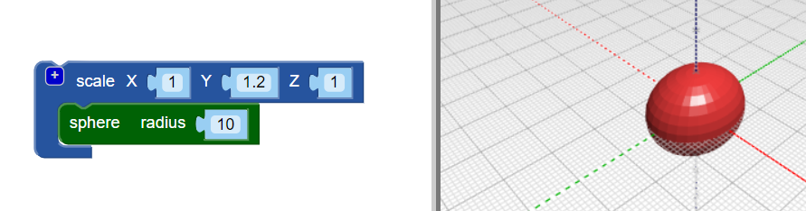

## 给你的虫子一个身体

--- task ---

在Web浏览器中打开BlocksCAD编辑器 [blockscad3d.com/editor/](https://www.blockscad3d.com/editor/){：target =“ _ blank”}

--- /task ---

现在创建您的错误的主体。

--- task ---

从半径为 `10` 的 `球体` 开始（这里的单位是毫米）：

单击 **Render** 按钮以查看结果。

提示：您可以通过单击彩色正方形来更改渲染模型的颜色。

--- /task --- --- task ---

现在，沿球的Y轴拉伸球体，以为虫子创建细长体。

`比例`{：class =“ blockscadtransforms”}块使您可以沿X，Y和Z轴拉伸或挤压对象。 将Y值设置为 `1.2` 以沿Y轴拉伸球体。

再次单击“ **渲染** ，然后检查球体是否已拉伸为椭圆体。 从不同角度查看模型，以便了解其变化。

--- /task ---

提示：每次更改代码时，都需要单击 **Render** 以查看结果。

--- task ---

现在，沿z轴稍微挤压椭圆形，以制作出更扁平的虫子。

将轴值设置为低于 `1` 可使对象沿该轴变小。 因此，将 `比例`{：class =“ blockscadtransforms”}块中的Z值更改为 `0.8`。

--- /task ---

