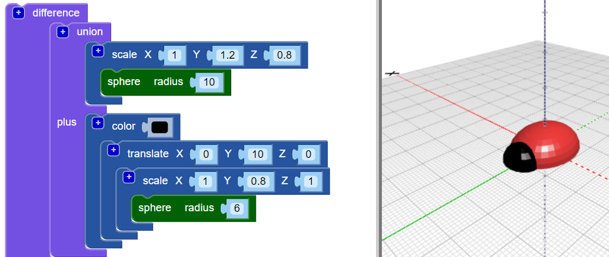

## 為你的昆蟲添加一個頭

現在，為昆蟲創建一個頭部。

--- task ---

新增一個較小的 `sphere` 球體為昆蟲的頭部。 現在您看不到這個新球體，因為它隱藏在昆蟲身體內。

還要在新的 `sphere` 上添加一個 `scale` 區塊以塑造頭部。

然後添加一個 `union`{:class="blockscadsetops"} 區塊以組合頭部和身體。

--- /task --- --- task ---

如果要查看新的  `sphere`，請通過右鍵點擊其 `scale`{:class="blockscadtransforms"} 區塊並選擇 **Disable block** 來暫時停用該身體。 然後，此區塊及其內部的區塊將變灰色，當你點擊 **Render**時，身體不會顯示。

再次右鍵點擊該區塊，然後選擇 **Enable block** 以啟用身體。

--- /task --- --- task ---

沿著Y軸 `Translate` 平移頭部，使其向外突出。

  

--- /task --- --- task ---

如果要清楚地看到不同的形狀，請更改頭部的顏色。

您還可以嘗試使用不同的顏色組合，以用永久性麥克筆裝飾你列印好的昆蟲。

--- /task --- --- task ---

你有辦法更改昆蟲模型身體的顏色嗎？ 你可以將其更改為要使用的印表機長絲的顏色，或更改為要對其進行著色的永久性麥克筆的顏色。

--- hints --- --- hint ---

這是你所需要的區塊。

--- /hint ---

--- hint ---

這是一個綠色身體的範例：

--- /hint --- --- /hints --- --- /task ---

  
